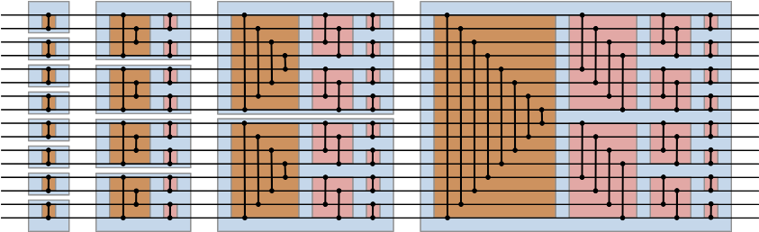

#A bitonic sorting network

##Getting started

In this task we should build a network for sorting. You use similar
networks when you want to parallel sorting or have several streams of
messages that should be sorted to several outgoing streams. The method
we should use is called bitonic sorter and has recursive pattern.

  

##A bitonic sorting network





Above you see a sorting network of size 16, it has 16 in-going streams
to the left and 16 outgoing streams to the right. The idea is that 16
numbers go through the network so that the smallest number always
exits at the uppermost stream and the largest number on the lowermost
stream.

Where two streams are connected by a vertical line a comparison is
performed. The smaller of the two values is forwarded on the upper
stream and the larger on the lower.

We see that we have a recursive pattern. A network for two streams is
of course trivial and only requires one comparison. To sort four
streams we 1/ first do a recursive sorting of two streams, then 2/ an
operation that in the picture is a brown area and the we will call
cross followed by 3/ two operations marked in red that we will
call merge.

The merge operation actually consist of a recursive repetition of a
  operation that we call zipc. If you look at how the network is
  sorting eight streams you see the two merge operations (one for the
  upper four streams and one for the lower four streams) internally
  consist of a zipc operation followed by two zipc operations on two
  streams each.


When we implement these networks the comparisons will be processes
  and the network defined by the route messages are sent. A comparison
  process will wait for two incoming messages, compare the the values
  and forward the messages in the graph.


##a comparing process

The first you should do is to define a process that receives two
  messages, compares the values and forwards the smaller to one
  process and the larger to another. We must keep track of the
  messages and make sure that they belong to the same group so we keep
  track of which epoch that should be handled and only accept
  messages of the current epoch.

The messages to the process will have the following structure:


* `{:epoch, n, x}` :  `x` is a value of two in epoch `n`
* `{:done, n}`  : the process should terminate


When the process is started it expects two messages from epoch $$0$$,
  two messages in epoch $$1$$ etc. It will forward the messages in the
  same format and same epoch number. A "done-message" is forwarded
  to both processes to terminate the whole network.


Implement a function `comp/2` that takes two arguments,
  identifiers to the two processes to which the sorted values should be
  sent, starts a comparing process and returns the process
  identifier. The process should expect messages starting with epoch $$0$$.


```elixir
def comp(low, high) do spawn(fn() -> comp(0, low, high) end)  end
  
def comp(n, low, high) do
  receive do    {:done, ^n} ->
      send(low, {:done, n})   
      send(high, {:done, n})
    {:epoc, ^n, x1} ->
      receive do
        {:epoc, ^n, x2} ->
          if x1 < x2 do
            send(low,  {:epoc, n, x1})
            send(high, {:epoc, n, x2})
          else
            send(low, {:epoc, n, x2})
            send(high,{:epoc, n, x1})
          end
          comp(n+1, low, high)
      end
  end
end
```


###sorter/1

Assume that we have a function `setup/1` that takes a list of
  process identifiers and starts all processes needed for the sorting
  network. The list of process identifiers are the processes, in
  order, that the network should deliver the sorted values to. The
  function returns a list of process identifiers that the values in
  each epoch should be sent to.

If we build a sorting network of size $$4$$, the function will start
  six processes and return a list `[i1,i1,i2,i2]` where `i1`
  and `i2` are the identifiers of the two first processes in the
  network. You should not implement `setup/1` now, we assume that
  it works.


Implement a function `sorter/1` that takes a list of process
identifiers, the processes to which we shall send the sorted
epochs. The function should starta process that accept two messages: a
request to sort a number of values and one to terminate the execution.

  

* `{:sort, epoch}` : Where `epoch` is a list of values to be sorted. We assume that
    there are the same number of values as we have a sorting network
    for i.e. the values are sent to the in-going streams in the network
    (order does not matter).  Don't forget to set the epoch number and
    increment a counter so that the next request is marked as the next epoch.


* `:done` : terminate the network, forward to both processes


To your help you can use the following functions:


* `each(list, fun)` Apply a function to each element in the list.
* `zip(list1, list2)` Return a list of tuples that consist of elements
* from the two lists. A call to Ett anrop till `zip([1,2],[:a,:b])`
* would return `[{1,:a},{2,::b]`.


```elixir
def sorter(sinks) do
  spawn(fn() -> init(sinks) end)
end
  
def init(sinks) do
  netw = setup(sinks)
  sorter(0, netw)
end

def sorter(n, netw) do
  receive do
    {:sort, this} ->
      each(zip(netw, this), 
           fn({cmp, x}) -> send(cmp,{:epoc, n, x}) end)
      sorter(n+1, netw)
    :done ->
      each(netw, fn(cmp) -> send(cmp, {:done, n}) end)
  end
end
```

###setup for $$n = 2$$ 

Time for the tougher part but we start with something simple. You
  should now implement the function {\tt setup/2} that takes two
  arguments, a number $$n$$ and a list of $$n$$ process identifiers. The
  process identifiers are the outgoing streams of the network, the
  function should start and connect all required processes in the
  network and return a list of entry points to the network. The
  function is then used to implement `setup/1` that is given
  below. We assume that $$n$$ is an even multiple of $$2$$ i.e. $$2,4,8,...$$


```elixir
  def setup(sinks) do 
    n = length(sinks)
    setup(n, sinks)
 end
```

Since we're starting simple, you should in this question only handle
  the case when $$n$$ is equal to $$2$$ (which means that the list only
  has two elements). You should of course use a function that you have
  defined in a previous question to start a comparison process. 


```elixir
  def setup(2, [s1, s2]) do
    cmp = comp(s1, s2)
    [cmp, cmp]
  end
```


###merge for $$n = 2$$

You now have all you need to start a network of size $$2$$ but this is
  of course close to ridiculous so we should extend it to size of
  $$4$$. You start by implementing a function that will set up a network
  to do a merge operation i.e. the red part in the
  Fig~\ref{fig:bitonic}. The function `merge/2` takes a vale $$n$$
  and a list of $$n$$ process identifiers. The function returns a list
  of process identifiers that make up the entry points of the merging
  network.

  We start with something simple, you should implement `merge/2`
  so that it works for $$n = 2$$.


```elixir
  def merge(2, [s1,s2]) do
    cmp1 = comp(s1,s2)
    [cmp1, cmp1]
  end
```

###cross/2

Now for something slightly more complicated, the operation we call
  cross i.e. the brown operation in the image above. You
  should implement the function `cross/2` that takes two lists of
  process identifiers. The lists represent the $$n/2$$ upper and $$n/2$$
  lower outgoing streams. The function should return a tuple
  consisting of two lists, the $$n/2$$ upper and $$n/2$$ lower entry
  points. The function should work for any $$n$$.

You can use the function `reverse/1` that reverses a list.

```elixir
  def cross(low, high) do
    cross(low,  reverse(high), [])
  end

  def cross([], [], crossed) do
    {reverse(crossed), crossed}
  end
  def cross([l|low], [h|high], crossed) do
    cmp = comp(l, h)
    cross(low, high, [cmp | crossed])
  end
```


###setup for $$n = 4$$

We now assume that the functions `setup/2`, `merge/2` and `cross/2`
  works when $$n=2$$, you should use these and extend `setup/2` to work
  if $$n = 4$$.

```elixir
   def setupp(4, [s1,s2,s3,s4]) do
     [m1, m2] = merge(2, [s1,s2])
     [m3, m4] = merge(2, [s3,s4])

     {[c1, c2], [c3, c4]} = cross([m1, m2], [m3, m4])

     [i1, i2] = setup(2, [c1, c2])
     [i3, i4] = setup(2, [c3, c4])

     [i1, i2, i3, i4]
   end
```


###merge/2


Time to extend `merge/2` to be able to handle any value of $$n$$
  ($$2,4,8,...$$). The function now becomes a recursive function where
  you in each recursion perform what we called a zipc operation. The
  zipc operation is the transformation marked with red in the image
  above, so start by defining a function `zipc/2` that performs this
  operation on two set of lists of length $$n/2$$ and returns the entry
  points that you need.


You can use the arithmetic operation `div/2` that performs
  integer division and the library function `split/2` that takes
  list and a number $$n$$ and returns a tuple of two sub-lists, the $$n$$
  first elements and the rest.

```elixir
  def merge(n, sinks) do
    n = div(n,2)
    {sink_low, sink_high} = split(sinks, n)
    merged_low =  merge(n, sink_low)    
    merged_high =  merge(n, sink_high)
    zipced = zipc(merged_low, merged_high)
    zipced ++ zipced
  end  

  def zipc([], []) do [] end
  def zipc([l|low], [h|high]) do
    cmp = comp(l,h)
    [cmp | zipc(low, high)]
  end
  ```

  
###a network for $$2^n$$


Now it is time to extend `setup/2` to handle arbitrary values of $$n$$
  ($$2,4,8,...$$). Extend the function with the general case, use
  `div/2`, `split/2` and of course the functions `merge/2` and
  `cross/2` that we now assume works for all $$n$$.


```elixir
  def setup(n, sinks) do
    n = div(n,2)
    {sink_low, sink_high} = split(sinks, n)
    merge_low = merge(n, sink_low)
    merge_high = merge(n, sink_high)
    {cross_low, cross_high} = cross(merge_low, merge_high)
    in_low = setup(n, cross_low)
    in_high = setup(n, cross_high)
    in_low ++ in_high
```


